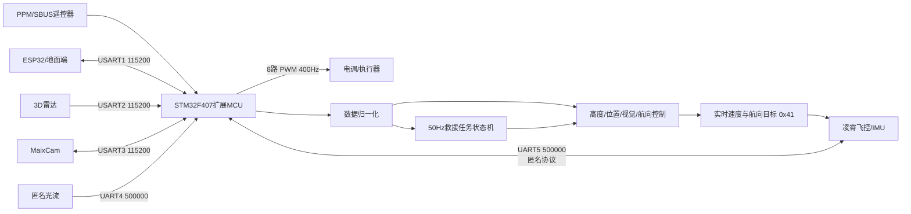
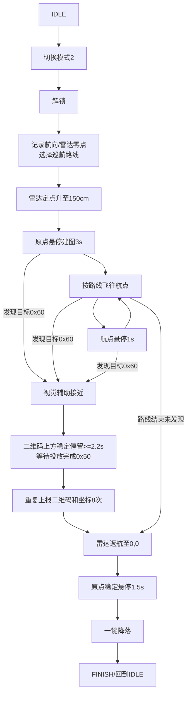

# ANO_LX 工程总结

> 阅读基线：分支 `ano_vison_follow`，提交 `79043d8`。  
> 总结日期：2026-07-22。  
> 阅读范围：工程内全部目录与工程配置；逐文件阅读 `FcSrc`、`DriversBsp`、`DriversMcu/STM32F407/Drivers`，并核对 Keil 工程实际纳入的 CMSIS、STM32 标准外设库文件及已有构建产物。第三方库按组件和被引用范围归纳，不逐项复述其通用 API。

## 1. 工程定位

这是一个运行在 **STM32F407VGTx** 上的凌霄飞控扩展 MCU 固件。它本身不是完整的姿态解算和电机混控飞控，而是位于遥控器、外部传感器、任务设备与凌霄飞控/IMU之间，承担以下职责：

1. 接收 PPM/SBUS 遥控数据，并向凌霄飞控转发遥控通道与实时速度/航向目标。
2. 通过匿名通信协议接收飞控姿态、速度、高度、状态和 8 路 PWM数据。
3. 接收光流、3D 雷达和 MaixCam 数据，完成定高、定位、航向和视觉辅助控制。
4. 与 ESP32/地面端交互，接收任务和二维码类型，回传遥测、调试状态及二维码坐标。
5. 执行“低空无人机智慧救援”自动任务：起飞、建图、巡航搜索、视觉对准/投放、上报、返航和降落。
6. 将飞控发来的 8 路 PWM转换为本机 8 路 400 Hz 电调输出。

当前工程明显由两部分叠加而成：

- 匿名科创原始凌霄 MCU 框架：调度、匿名协议、遥控、光流、GPS、PWM、LED、ADC等。
- 电赛任务扩展：`my_*` 文件和大幅扩展后的 `User_Task.c`，增加 ESP32、3D 雷达、MaixCam、多源位置环和救援任务状态机。

## 2. 工程规模与目录

| 区域 | 文件数 | C/头文件等 | 代码行数 | 作用 |
| --- | ---: | ---: | ---: | --- |
| `FcSrc` | 26 | 26 | 4,604 | 主程序、通信、控制器、救援任务 |
| `DriversBsp` | 8 | 8 | 1,529 | 初始化、数学、光流、u-blox GPS |
| `DriversMcu/STM32F407/Drivers` | 16 | 16 | 1,645 | UART、定时器、PWM、遥控、ADC、LED、中断 |
| CMSIS | 267 | 256 | 92,060 | Cortex-M4 内核、启动文件、DSP源码全集 |
| STM32 StdPeriph | 58 | 57 | 38,098 | STM32F4 标准外设库 |
| USBStack | 31 | 31 | 7,973 | USB设备栈，当前 Keil target 未纳入编译 |

目录职责：

```text
ANO_LX/
|-- FcSrc/                    # 飞控接口、调度、控制算法、任务逻辑
|-- DriversBsp/               # 板级业务驱动和传感器协议
|-- DriversMcu/STM32F407/
|   |-- Drivers/              # 本工程实际使用的 MCU 外设封装
|   `-- Libraries/            # CMSIS、StdPeriph、USB第三方库
|-- ProjectSTM32F407/         # Keil工程、调试配置和构建产物
`-- .vscode/                  # 文件关联配置
```

## 3. 硬件与构建环境

| 项目 | 配置 |
| --- | --- |
| MCU | STM32F407VGTx，Cortex-M4 + FPU |
| 主频 | 168 MHz |
| Flash | 1 MB，`0x08000000` 起 |
| SRAM1/2 | 128 KB，`0x20000000` 起 |
| CCM RAM | 64 KB，`0x10000000` 起 |
| 工程 | Keil MDK / uVision，`ProjectSTM32F407/ANO_LX_STM32F407.uvprojx` |
| 编译器 | ARMCC 5.06 update 5，C99模式 |
| 宏 | `USE_STDPERIPH_DRIVER`、`USE_USB_OTG_FS` |
|输出 | `build/ANO_LX.axf`、`build/ANO_LX.hex`、根目录相对工程的 `ANO-LX.bin` |

已有构建日志记录为 **0 Error / 0 Warning**，映像大小为：

- RO：61,376 B（约 59.94 KB）
- RW + ZI：7,224 B（约 7.05 KB）
- ROM：61,608 B（约 60.16 KB）

注意：日志中记录的工程绝对路径仍指向旧的“2023年电赛复刻”目录，因此它只能证明对应源码曾成功构建，不能严格证明当前工作区内容已被重新完整编译。

## 4. 总体架构



核心数据链路是：

```text
UART中断收字节 -> 100字节环形接收缓存
-> TIM7 的 1ms任务中解析协议
-> 更新全局传感器/状态变量
-> main循环的 1kHz PID计算控制目标
-> TIM7 的 1ms任务读取目标并发送 0x41 帧给凌霄飞控
```

## 5. 启动与执行模型

### 5.1 启动顺序

`main()` 只做三件事：

1. `All_Init()` 初始化硬件和协议。
2. `Scheduler_Setup()` 计算各裸机任务周期。
3. 在 `while (1)` 中持续调用 `Scheduler_Run()`。

`All_Init()` 的实际顺序为：系统时基、LED、8 路 PWM、UART1~5、遥控输入、ADC、匿名协议、GPS初始化、TIM7 周期中断。初始化中包含约 1.3 秒固定延时，加上 GPS配置延时。

### 5.2 两套调度上下文

工程不是 RTOS，而是“中断固定任务 + main轮询调度器”：

| 上下文 | 周期 | 主要工作 |
| --- | ---: | --- |
| TIM7 中断 `ANO_LX_Task()` | 1 ms | 串口解析、GPS准备、外部传感器转发、匿名协议收发、PWM输出、LED驱动 |
| TIM7 内部分频 | 10 ms | 遥控检查、目标生成、飞控状态、光流在线检查 |
| TIM7 内部分频 | 100 ms | 电池电压更新 |
| main `Loop_1000Hz()` | 1 ms | `get_data()`、`PID()` |
| main `Loop_100Hz()` | 10 ms | 向 ESP32发送雷达坐标、高度和航向 |
| main `Loop_50Hz()` | 20 ms | 救援任务状态机 `UserTask_OneKeyCmd()` |
| 500/200/20/2 Hz槽位 | 对应周期 | 当前基本为空 |

轮询调度器以 SysTick 毫秒计数判断到期，不补跑错过的周期；任务执行时间过长时会产生抖动或降频。

## 6. 主要源码模块

### 6.1 原始飞控接口层

| 文件 | 作用 |
| --- | --- |
| `main.c` | 初始化并进入裸机调度循环 |
| `Ano_Scheduler.c/.h` | 1000/500/200/100/50/20/2 Hz轮询调度 |
| `ANO_LX.c/.h` | 遥控映射、实时控制目标、飞控数据结构、PWM输出、电池采样、1ms总任务 |
| `ANO_DT_LX.c/.h` | 匿名协议收发、双累加校验、周期/事件触发帧和 CMD重发 |
| `LX_FC_State.c/.h` | 飞控模式/解锁状态，摇杆解锁、上锁和校准手势 |
| `LX_FC_Fun.c/.h` | 模式、解锁、返航、起降、平移、转向和校准命令封装 |
| `LX_FC_EXT_Sensor.c/.h` | 将光流速度/高度转换为通用外部传感器帧 |
| `SysConfig.h` | 1kHz时基、400Hz PWM、设备地址/版本和基础类型 |

### 6.2 电赛控制与任务层

| 文件 | 作用 |
| --- | --- |
| `my_get_data.c/.h` | 把飞控/雷达/光流全局数据统一为角度、速度、高度和坐标；展开跨越 ±180° 的连续 yaw |
| `my_pid.c/.h` | 高度 P、光流/雷达径向 PD、相机分轴 PD、航向 P控制；最后一次性提交速度目标 |
| `my_contrl.c/.h` | 控制模式选择、目标/零点管理、航向绝对保持和相对转向接口 |
| `my_uart.c/.h` | ESP32、3D 雷达、旧 K230/OpenMV、MaixCam接收状态机与数据解析 |
| `my_send_test.c/.h` | ESP32遥测/调试、二维码结果帧及 MaixCam命令发送 |
| `User_Task.c/.h` | 50Hz完整救援任务状态机、三条巡航路线、视觉锁定/投放确认、返航降落 |

### 6.3 板级与 MCU 驱动

| 文件 | 作用 |
| --- | --- |
| `Drv_BSP.c/.h` | 全局初始化、PPM/SBUS数据归一化和失控判断 |
| `Drv_AnoOf.c/.h` | 匿名光流 0x51/0x34/0x01/0x04 帧解析 |
| `Drv_UbloxGPS.c/.h` | u-blox M8 配置、UBX NAV-PVT解析和 0x30 GPS帧准备 |
| `Ano_Math.c/.h` | 快速三角函数、平方根、死区、插值、向量运算 |
| `Drv_Uart.c/.h` | UART1~5 中断收发及软件缓冲 |
| `Drv_RcIn.c/.h` | PC7 上的 PPM/TIM3 或 SBUS/USART6 输入 |
| `Drv_PwmOut.c/.h` | TIM1/TIM5/TIM8 的 8 路 400Hz PWM |
| `Drv_adc.c/.h` | PC5/ADC1_IN15 + DMA循环采集电池电压 |
| `Drv_led.c/.h` | PE0/PE1/PE2/PE7 四路 LED软件亮度控制 |
| `Drv_Sys.c/.h` | SysTick 1ms时基和忙等待延时 |
| `Drv_Timer.c/.h` | TIM7 约 1ms系统任务中断 |
| `stm32f4xx_it.c` | 异常、TIM3/TIM7、UART1~6 中断入口 |

## 7. 控制算法

### 7.1 数据来源

| 变量 | 来源 | 单位/含义 |
| --- | --- | --- |
| `rol/pit/yaw` | UART5 飞控姿态帧 0x03 | 度；yaw被展开为连续角 |
| `vel_x/vel_y` | UART5 飞行速度帧 0x07 | cm/s |
| `hight` | UART5 高度帧 0x05 的 `alt_add` | cm |
| `dis_x/dis_y` | UART4 光流积分 | cm，当前控制主流程基本不使用 |
| `dis_x_slam/dis_y_slam/yaw_slam` | UART2 3D 雷达 | cm / 雷达航向原始值 |
| `dis_x_cam_target/dis_y_cam_target` | UART3 MaixCam | 相对目标偏差，cm |

### 7.2 控制模式

`mode_select()` 会先清除所有控制源，再选择一组互斥控制：

| 模式 | 高度 | XY位置 | 航向 |
| ---: | --- | --- | --- |
| 1/2 | 高度 P | 光流/飞控坐标径向 PD | 航向 P |
| 3 | 高度 P | 相机 X/Y分轴 PD | 航向 P |
| 4 | 高度 P | 3D 雷达径向 PD | 航向 P |

当前自动任务主要使用模式 4：雷达维持绝对位置，相机偏差用于动态修正雷达目标点，而不是直接切换到纯相机模式。

### 7.3 关键参数

| 控制项 | 参数 | 默认值 |
| --- | --- | ---: |
| 高度 | `velocity = 3 * height_error` | 限幅 ±20 cm/s |
| 光流 XY | `KP_xy/KD_xy` | 1.0 / 0，限速 30 cm/s |
| 雷达 XY | `KP_radar/KD_radar` | 0.45 / 0.05，任务动态限速 12~30 cm/s |
| 视觉 X/Y | `KP_MV_X/Y` | 0.3 / 0.3 |
| 视觉 X/Y微分 | `KD_MV_X/Y` | 0.08 / 0.08 |
| 视觉输出 | X/Y硬限幅 | 20 / 18 cm/s |
| 航向 | `KP_yaw` | 2.0，死区 1°，限幅 ±30 |

`PID()` 使用局部变量完成一整周期计算后再统一写入 `my_give_vel_*`，目的是降低 TIM7 中断读到“计算一半的临时零值”的概率。

## 8. 自动救援任务

### 8.1 启动与人工优先级

- CH6 高位（1700~2200）：锁存并启动一次完整自动任务。
- CH6 中位（1400~1600）：最高优先级触发一键降落，并复位自动任务状态。
- 遥控无信号：50Hz任务立即返回；底层失控逻辑会让实时目标归零/给定保守油门，并尝试切程控模式后返航。
- 自动任务启动后不要求 CH6 一直保持高位。

### 8.2 状态机



主要约束：

- 起飞、搜索和投放高度当前均为 150 cm。
- 地图飞行范围被限制在 X=0~240 cm、Y=0~300 cm。
- 到达判定：普通位置 ±10 cm，返航位置 ±7 cm，高度 ±10 cm，航向 ±2°。
- 三条固定扫描路线分别为横向 S形、纵向条带和斜向折线。
- `ROUTE_FORCE_ID=255` 时，用遥控、航向、高度和雷达坐标之和取模，形成“伪随机”路线；它不是随机数发生器。
- 每个航点要求连续稳定 200 ms；起飞稳定 500 ms；返航稳定 600 ms。

### 8.3 视觉对准与投放确认

1. ESP32选择二维码 A/B/C（0xCA/0xCB/0xCC），MCU保存并周期发送给 MaixCam。
2. MaixCam发回控制位 0x60 时，表示相机锁定并请求视觉辅助。
3. 雷达提供绝对位置，相机偏差乘 1.4 后叠加到雷达当前位置，得到二维码绝对坐标估计。
4. 坐标用 1/4 一阶滤波，并将每周期目标变化限制为 10 cm。
5. 相机偏差在 X/Y各 ±15 cm、雷达/高度也到位时，累计中心停留 2.2秒。
6. 推荐投放完成标志是 MaixCam 的 `0x50 + (1,1)`；兼容逻辑也接受中心停留完成后的普通 `0x50 + (0,0)`，但要求持续确认 400 ms。
7. 视觉阶段 25秒超时且已有目标估计时，保存当前估计并返航，避免无限悬停。

## 9. 通信与引脚

### 9.1 串口映射

| 接口 | 引脚 | 波特率 | 当前回调/设备 | 方向 |
| --- | --- | ---: | --- | --- |
| USART1 | PA9 TX / PA10 RX | 115200 | ESP32协议 | 双向 |
| USART2 | PD5 TX / PD6 RX | 115200 | 3D 雷达 | 主要接收 |
| USART3 | PB10 TX / PB11 RX | 115200 | MaixCam | 双向 |
| UART4 | PA0 TX / PA1 RX | 500000 | 匿名光流 | 主要接收 |
| UART5 | PC12 TX / PD2 RX | 500000 | 凌霄飞控/IMU匿名协议 | 双向 |
| USART6 | PC7 RX | 100000, 8E2 | SBUS备选 | 接收 |
| TIM3 CH2 | PC7 | 1 us计数 | PPM，默认初始化 | 接收 |

每个 UART使用 100字节 RX环形缓存和 256字节 TX缓存；UART中断只搬运字节，完整协议在 1ms任务中解析。

### 9.2 ESP32协议

接收固定 8字节帧：

```text
BB 10 F1 FUNC MESSAGE EE SC AC
```

- `FUNC=0x10`：任务命令，`MESSAGE=0x00~0x04` 映射为 `my_task_flag`。
- `FUNC=0x20`：选择二维码，允许 0xCA/0xCB/0xCC，并立即转发给 MaixCam。
- `SC/AC`：与匿名协议相同的双累加校验。

发送内容包括：

- 100Hz遥测：雷达 X、雷达 Y、高度、雷达 yaw。
- 单值调试状态帧。
- 二维码结果：`AA BB device qr_type xH xL yH yL FF`，X/Y为大端有符号 16位整数。

### 9.3 3D 雷达协议

当前解析器接收固定 14字节：

```text
AA xH xL yH yL zH zL rollH rollL pitchH pitchL yawH yawL 0A
```

所有字段按大端有符号 16位解析；当前只使用 X、Y、yaw，Z/roll/pitch未进入控制。协议没有校验和、序号或超时失效机制。

### 9.4 MaixCam协议

MCU到相机：

```text
BB qr_type FF
```

相机到 MCU固定 10字节：

```text
BB qr_type control signX xH xL signY yH yL FF
```

- `control=0x60`：相机接管/目标有效，X/Y作为目标偏差。
- `control=0x50`：飞控接管/相机释放，X/Y清零；任务层进一步判断是否表示投放完成。
- 接收器支持遇到新 `0xBB` 时重新同步，但没有校验和。

### 9.5 凌霄/匿名协议

通用帧格式：

```text
AA DEST FUNC LEN PAYLOAD... SC AC
```

设备地址为 `0x61`，广播地址为 `0xFF`。主要帧：

| 功能码 | 方向 | 内容 |
| --- | --- | --- |
| 0x03 | 飞控 -> MCU | 欧拉姿态 |
| 0x05 | 飞控 -> MCU | 高度 |
| 0x06 | 飞控 -> MCU | 模式、解锁和命令状态 |
| 0x07 | 飞控 -> MCU | XYZ速度 |
| 0x08 | 飞控 -> MCU | 位置偏移 |
| 0x20 | 飞控 -> MCU | 8路 PWM |
| 0x0D | MCU -> 飞控 | 电池电压/电流，100ms |
| 0x30 | MCU -> 飞控 | GPS |
| 0x33 | MCU -> 飞控 | 通用速度/光流 |
| 0x34 | MCU -> 飞控 | 通用距离/光流高度 |
| 0x40 | MCU -> 飞控 | 10通道遥控，20ms |
| 0x41 | MCU -> 飞控 | roll/pitch/throttle、yaw速度、XYZ速度目标 |
| 0xE0 | 双向 | 命令，等待 CK并最多重发4次 |
| 0xE1/0xE2 | 双向 | 参数读/写应答框架 |

### 9.6 其他 IO

- 电池：PC5 / ADC1_IN15，DMA采 50点，按 10k:1k 分压换算。
- LED：PE1红、PE0绿、PE2蓝、PE7辅助灯。
- PWM1~8：PE14、PE13、PE11、PE9、PA3、PA2、PC9、PC8，对应 TIM1/5/8；400Hz，脉宽 1000~2000 us。

## 10. 第三方组件与实际编译范围

- CMSIS版本为 V2.10，仓库保存了完整 Core和 DSP源码；当前 target只编译启动文件和 `system_stm32f4xx.c`，没有使用 CMSIS-DSP算法文件。
- STM32F4 Standard Peripheral Library仓库是早期 V1.x系列；target只编译 misc、ADC、DMA、EXTI、FLASH、GPIO、RCC、SPI、TIM、USART等实际依赖文件。
- `USBStack` 虽存在且定义了 `USE_USB_OTG_FS`，但当前 Keil target没有加入任何 USB源文件，业务代码也没有 USB入口。
- 工程引用 `Doc/note.txt`，但当前工作区没有 `Doc` 目录，该条目是失效的历史引用。

## 11. 需优先复核的问题

以下是阅读源码后可以直接定位的风险，不代表已经在实机上复现。

### 高优先级

1. **USART1 的 ESP32与 GPS配置冲突。** `Drv_Uart.c` 把 USART1接收固定映射到 `MY_uart_esp_receive()`，但 `All_Init()` 随后调用 `Init_GPS()`，它又反复重配 USART1并向同一端口发送 u-blox配置。`UBLOX_M8_GPS_Data_Receive()` 没有任何调用点，因此当前 GPS接收链路实际不可达；若 PA9/PA10 接的是 ESP32，启动时还会向 ESP32发送 GPS二进制配置。
2. **四元数解析分支不可达。** `ANO_DT_LX.c` 先用 `0x03` 解析欧拉角，紧接着又用 `else if (0x03)` 解析四元数，第二个分支永远不会执行。按注释四元数通常应是 0x04。
3. **LED输出掩码未初始化。** `LED_1ms_DRV()` 的局部变量 `led_tmp` 在按位读改写前没有赋初值，属于未定义行为，可能造成 LED随机闪烁。
4. **本地 PWM安全门被绕过。** `ANO_LX_Task()` 始终调用 `ESC_Output(1)`，没有使用 `fc_sta.unlock_sta`。本机不会因“飞控未解锁”主动将 8路输出清零，安全完全依赖 UART5发来的 PWM值。

### 中优先级

1. UART RX/TX软件环形缓存没有满检测、丢包计数或并发保护。100Hz遥测、调试帧和匿名协议密集发送时，256字节计数回绕可能覆盖尚未发送的数据。
2. 雷达和 MaixCam协议只有帧头/帧尾，没有校验；雷达也没有“最后有效帧时间”超时判定。`my_slam_flag` 在成功收帧后置 1，但不会因长期断流自动清零，任务可能继续使用旧坐标。
3. 自动任务的模式切换/解锁步骤以“命令成功入队”为前进条件，不等待 `fc_mode_sta` 或 `unlock_sta`确认。通信延迟或飞控拒绝命令时，状态机仍可能进入下一步。
4. `AnoOF_Check_State()` 注释声称 500 ms超时，但函数每 10 ms调用一次且计数每次只加 1，实际约为 5秒；传入的 `dT_s` 未使用。
5. 控制变量在 main和 TIM7 中断之间共享，多数未声明 `volatile`。当前 32位标量写入通常是原子的，但编译器可见性和多变量一致性仍依赖实现；代码只对 PID输出做了“最后统一提交”的部分缓解。
6. `User_Task.c` 长达 1,158行，任务参数、状态、路线和相机协议强耦合在一个文件中，后续改赛题流程时回归风险较高。

### 工程维护问题

- 一部分早期中文注释已经出现乱码或混合编码，影响维护但不影响编译。
- VS Code的 `c_cpp_properties.json` 仍使用另一台机器的 `E:\UAVSOURCE\...` 绝对路径，当前目录下 IntelliSense可能无法正确索引。
- 仓库提交了 AXF/HEX/BIN、OBJ、CRF、MAP、J-Link日志等大量构建产物，增加了仓库体积和源码/固件版本不一致的可能。
- 若干接口只保留未使用实现或声明不一致，例如旧 K230/OpenMV路径、`MY_uart_radar_send`、`MY_uart_K230_anl`、`OneKey_Takeoff()` 和静态 `keep_cam_dis()`。

## 12. 当前工程的关键结论

1. 当前核心定位方式是 **3D 雷达绝对坐标为主、MaixCam偏差修正为辅**；光流和 GPS代码仍保留，但不是自动救援任务的主要位置源。
2. 自动任务真正的控制输出不是直接产生电机 PWM，而是计算 `vel_x/vel_y/vel_z/yaw_dps`，通过匿名协议 0x41交给凌霄飞控闭环执行。
3. 任务安全入口主要依赖 CH6：高位启动，中位降落；底层遥控失控另有切模式和返航逻辑。
4. 现有状态机已经覆盖比赛主流程和视觉丢帧/投放超时降级，但通信有效性、实际解锁确认和串口冲突仍是实机联调前最值得处理的部分。
5. 历史构建映像约 60 KB，远低于 STM32F407VG的 Flash/RAM容量，当前资源瓶颈更可能是实时性、串口可靠性和任务状态一致性，而不是存储空间。

