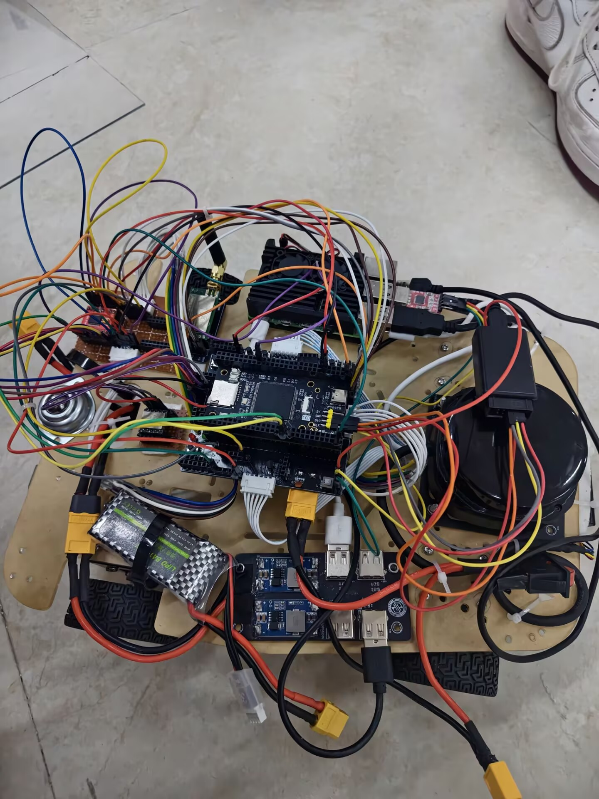
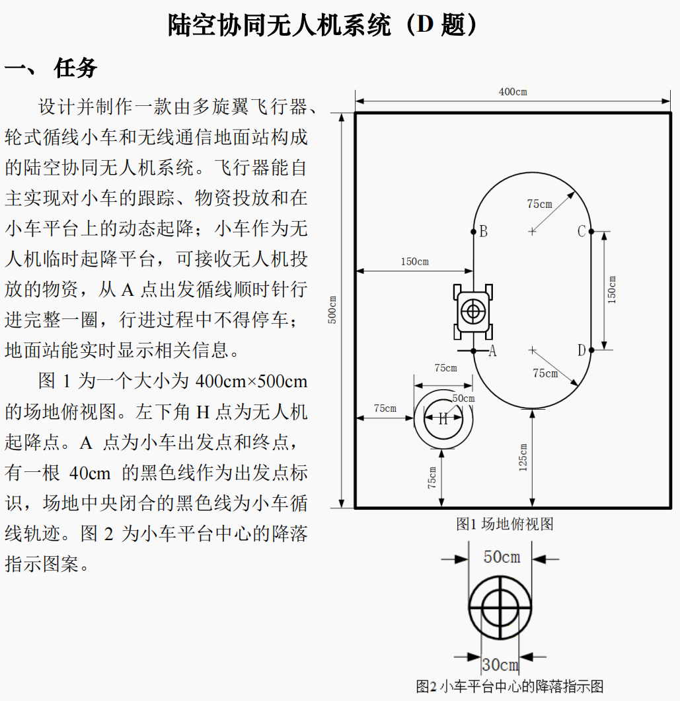

# 小车端比赛源码

本目录来自已烧录的比赛归档提交 `b63f401`（`release(car): archive flashed competition firmware`）。

- 主工程：`CMakeLists.txt`、`Hardware/`、`Src/`、`Inc/`、`Library/`、`Start/`、`System/`。
- 辅助脚本：`scripts/`。
- 基于 STM32F103ZET6 的八路灰度循迹智能小车。当前比赛镜像以灰度为主输入，结合前轮编码器与 JY901 航向辅助；单轮速度内环使用 `SpeedLadrc`，工程使用 STM32 标准外设库。
- [小车 PCB 原理图](../docs/小车pcb原理图展示.pdf)
- [D 题小车端实施基线](../docs/D题小车端实施基线.md)

## 系统实物与场地

<p align="center">
  
</p>

<p align="center">小车平台　·　多旋翼飞行器　·　树莓派地面站</p>

<p align="center">
  
</p>

> 图片用于说明设备组成、场地和界面，不单独证明循迹、通信、投放或降落已通过；
> 每轮实测仍应以小车、空中端和地面站的同轮日志/视频为准。

## 当前比赛固件说明（源码优先）

> 本节依据当前 `LineFollowMissionDebug` 源码整理，用于校正本文后续保留的
> 历史笔记、设计经验和待办项。后文的原始经验**完整保留**，但若与本节、
> `docs/D题小车端实施基线.md` 或当前接线冲突，应以前三者为准。
> 本节仅维护小车端；Pi/雷达建图、飞控、MaixCam 与地面站由对应负责人维护。

### 当前入口与控制链路

- 比赛预设为 `LineFollowMissionDebug`；入口是
  `Src/main_line_follow_mission.c` 与 `Hardware/app_line_follow_mission.c`，
  不是历史 `User/main.c`。
- 工程当前使用 STM32 标准外设库（`USE_STDPERIPH_DRIVER`）。
- 每个 20 ms 控制周期扫描灰度、读取 JY901 与前轮编码器：

  ```text
  灰度扫描 + JY901 航向/角速度 + 前轮编码器
      -> app_line_observer（循迹误差、宽线/丢线、航向辅助）
      -> 目标左右轮速度（任务阶段、里程与安全限速）
      -> speed_ladrc 单轮速度内环
      -> 前轮 TB6612；后轮开环跟随
  ```

- 前轮有编码器速度反馈；后轮目前只是带方向修正和限幅的开环跟随前轮（减少轮子混乱）。
  `TIM4/TIM8` 后轮编码器闭环及方向标定尚未完成，不能写成“四轮闭环已验收”。

### 当前引脚与通信约束

| 功能 | 当前引脚/外设 | 说明 |
| --- | --- | --- |
| 灰度扫描 | `PC0/PC1/PC2` 为 `AD0/AD1/AD2`，`PG0` 为 `OUT` | 74HC4051 式地址选通；`000..111` 对应 `X1..X8`，不是 8 路 ADC 或 `PF` 直读。 |
| 前轮驱动 | `PA2/PA3 TIM2_CH3/CH4`，`PE2..PE6` | 前轮 TB6612，`PE6` 是 STBY，复位/故障时保持低。 |
| 前轮编码器 | `PA0/PA1 TIM5`，`PA6/PA7 TIM3` | 当前速度反馈、里程门与 A 点接近辅助。 |
| 后轮驱动 | `PE13/PE14`，`PF1..PF4`，`PB9` | 后轮 TB6612；后轮编码器候选为 `PB6/PB7`、`PC6/PC7`。 |
| 任务键 | `PG13` / `PG9`，低有效 | 任务一/任务二；运行中再次按下任一键为本地安全停止。 |
| 维护键 | `PG12`，低有效 | 仅停车态短按执行 MCU 本地维护复位；不能与任务二混用。 |
| JY901 | USART2 重映射 `PD5/PD6`，9600 8N1 | 航向数据不新鲜时，比赛预设不允许起步。 |
| Pi 位姿 | UART4 `PC11`，115200 8N1 | 只接收已校准的原生 `FIELD_GLOBAL` 位姿参与协同；旧 `FA...AB` 数据只作显示/诊断。 |
| LoRa | UART5 `PC12/PD2`，115200 8N1 | 小车端 V2.3 帧；不可同 Pi/Nano 共用。 |
| 诊断 | USART1 `PA9/PA10`，115200 8N1 | 状态与冻结日志的现场证据入口。 |

灰度白黑极性、`X4|X5` 中心掩码和左右符号应按
[`../docs/灰度循迹触发测试.md`](../docs/灰度循迹触发测试.md) 的实测记录复核。
当前预设的小车自有雷达到平台中心前向补偿为 `0 cm`，避免与 Pi/空中端补偿重复；
不要把历史的固定 `13 cm` 经验直接写入 MCU 参数，可以根据实际情况缩小误差。

### 当前任务、日志与构建入口

- 在 A 点全黑标志（或允许的稳定中心灰度回退）且 JY901 新鲜时，`PG13`/`PG9`
  可选择任务一/二。选定后电机至少保持关闭 20 s，随后由小车本地循迹，不等待
  `FOLLOW` 或地面站启动命令。
- 起步速度为任务一 `150 mm/s`、任务二 `170 mm/s`。Pi 位姿与无线阶段只影响
  受限速度阶段，不直接控制电机启停；灰度仍是横向循迹与最终 A 点确认的主依据。
- 诊断命令：`P` 读取当前参数/状态，`F` 导出最近一次冻结记录，`H` 显示帮助。
  `P` 或单条 ACK 不能替代赛道通过证据。
- 构建与烧录：

  ```powershell
  cmake --preset LineFollowMissionDebug
  cmake --build --preset LineFollowMissionDebug
  powershell -NoProfile -ExecutionPolicy Bypass -File .\scripts\jlink_flash.ps1 `
    -Configuration LineFollowMissionDebug -SwdSpeedKhz 50
  ```

比赛镜像可使用 [`scripts/jlink_flash_line_follow_mission.ps1`](scripts/jlink_flash_line_follow_mission.ps1)
烧录。当前任务门、速度、丢线和 A 点策略见
[`../docs/D题小车端实施基线.md`](../docs/D题小车端实施基线.md)。

### 历史内容保留原则

下方“学习经验”、原理图/PCB 过程、材料选择、扩展接口及历史模块记录均保留，
供复盘和后续硬件迭代使用；其中出现的 `PF1..PF9` 八路直读、`User/main.c`、
超声波/OLED/旧 PID 参数或未完成扩展，只能视为历史方案或待办，不能当作当前
`LineFollowMissionDebug` 的接线、控制逻辑或验收结论。

## 器件材料表
| 器件 | 型号/规格 | 说明 |
|------|-----------|------|
| 主控芯片 | STM32F103ZET6 | Cortex-M3, 72MHz, 512KB Flash, 64K

### 传感器模块
| 器件 | 型号/规格 | 说明 |
|------|-----------|------|
| 循迹传感器 | 亚博智能八路灰度传感器（蓝光） | `PC0/PC1/PC2` 选择 `X1..X8`，`PG0` 读取数字 `OUT`；白/黑极性与 `X4|X5` 中心样本见 [灰度触发测试](../docs/灰度循迹触发测试.md)。 |
| 陀螺仪模块 | WIT JY901B | USART2 重映射 `PD5/PD6`，用于 yaw 与角速度辅助。 |

### 雷达系统
| 器件 | 型号/规格 | 说明 |
|------|-----------|------|
| 板卡 | 树莓派 4 | 提供车端位姿；经 UART4 向 MCU 发送。 |
| 雷达模块 | 思岚 S2L | 雷达/Pi 子系统；MCU 侧接口为 UART4 `PC10/PC11`。 |
| 无线模块 | AS32-TTL-100-C | UART5 `PC12/PD2` 共信道 LoRa 透明传输。 |

### 驱动与动力
| 器件 | 型号/规格 | 说明 |
|------|-----------|------|
| 电机 | G513 霍尔编码器电机 | 带 AB 相正交编码器，PPR，减速比 |
| 橡胶轮 |65mm | 配套 513 电机 |
| 电机驱动 | TB6612FNG *2 | 双路 H 桥驱动，支持 PWM 调速 |

### 电源管理

| 器件 | 型号/规格 | 说明 |
|------|-----------|------|
| 锂电池 | 1500mAh格氏 | 卧式xt60
| 降压模块 | MP1584en | 固定 5V 稳压输出 |
| 六脚自锁开关 | 5.8*5.8 | 一路管控单片机5v，一路管理无线模块供电|


### 辅料与连接件

| 类别 | 明细 |
|------|------|
| 螺丝紧固 | M3 螺丝、各种高度铜柱、厚螺母；M2 螺丝、螺母 |
| 连接器 | 2.54mm 排针、排母、四层塑高18.5针长5.0加高排母至少29p、长脚排针 |
| 接线 | 杜邦线所有种类 |
| 被动元件 | 10uF 直插电容、1uF 直插电容，100nF 贴片陶瓷电容、4.7K 限流直插电阻、1K 直插电阻，22pf加速 s8550三极管|
| 指示器件 | 直插 LED（红/绿/指示） |
| 开关| 四脚开关高按键、5.8六脚自锁开关|

## 功能特性

### 1. 八路灰度扫描与循迹观测

- 八路灰度模块由 `PC0/PC1/PC2` 选择 `X1..X8`，`PG0` 读取被选中的数字输出；它不是 8 路 GPIO 或 ADC 直读。
- `Hardware/app_line_observer.c` 将灰度掩码、JY901 航向和角速度转换为循迹误差、差速需求，以及正常/宽线/丢线等状态。
- 白黑极性、中心掩码和车体左右方向必须先按 [`../docs/灰度循迹触发测试.md`](../docs/灰度循迹触发测试.md) 的实测记录确认，不能沿用旧权重或旧 `PF` 引脚表。

### 2. 前轮速度闭环与后轮跟随

- `Hardware/speed_ladrc.c` 为前左、前右轮分别提供速度 LADRC 内环；参数、输出限幅和变化率限制位于 `Hardware/app_line_follow_mission.c`。
- 前轮编码器为 `TIM5 PA0/PA1` 与 `TIM3 PA6/PA7`，用于速度反馈和累计里程；编码器方向必须先在实车上复核。
- 前轮 TB6612 使用 `PA2/PA3` PWM、`PE2..PE5` 方向和 `PE6` STBY。后轮 TB6612 是开环跟随前轮行为，不能误写为后轮闭环控制。

### 3. 按键、本地安全与任务速度

- `PG13`、`PG9` 为低有效的任务一、任务二实体按键；运行中再次按下任一键立即安全停止。
- `PG12` 为停车态、短按的维护复位键，不能与任务二复用。
- 任务一/二起步速度分别为 `150/170 mm/s`；接收匹配的合法任务阶段或任务二本地 D 门后才允许进入快速速度包络。无线 ACK 或地面站界面不能直接启停小车。
- 连续丢线达到 12 s 会安全停机；最终 A 点由里程、回航航向和稳定灰度共同判断，雷达/Pi 只作辅助。

### 4. 诊断与证据

- USART1 (`PA9/PA10`, 115200 8N1) 为现场诊断入口：`P` 读取参数和状态，`F` 导出冻结记录，`H` 显示帮助。
- `P` 只证明当前镜像配置，`F` 是一轮运行结束时的过程/终止证据；比赛镜像由 [`scripts/jlink_flash_line_follow_mission.ps1`](scripts/jlink_flash_line_follow_mission.ps1) 烧录。

## 项目结构

| 模块 | 主要文件 | 当前职责 |
| --- | --- | --- |
| 比赛入口 | `Src/main_line_follow_mission.c` | 安全上电、1 ms SysTick、诊断串口和任务主循环。 |
| 任务状态机 | `Hardware/app_line_follow_mission.c/.h` | 按键、起步延时、循迹状态、里程/航向门、停机、冻结记录和小车端无线帧。 |
| 灰度采集与观测 | `Hardware/bsp_gray_tracking.c/.h`、`Hardware/app_line_observer.c/.h` | 八路选通扫描、灰度误差、丢线/宽线与 JY901 航向辅助。 |
| 前轮执行与反馈 | `Hardware/bsp_motor.c/.h`、`Hardware/bsp_encoder.c/.h`、`Hardware/speed_ladrc.c/.h` | 前轮 TB6612、编码器、单轮速度 LADRC。 |
| 后轮跟随 | `Hardware/bsp_aux_tb6612.c/.h`、`Hardware/bsp_four_wheel_direction.h` | 后轮开环输出与物理正向符号。 |
| JY901 与 Pi 位姿 | `Hardware/bsp_gyro_wit.c/.h`、`Hardware/bsp_car_pose_link.c/.h` | 航向解析、UART4 位姿接收与校准状态。 |
| LoRa 协议 | `Hardware/bsp_robot_uart.c/.h`、`Hardware/bsp_v22_protocol.c/.h` | UART5 收发、CRC/地址检查和小车端 V2.3 帧。 |
| 诊断与安全 | `Hardware/bsp_diag_uart.c/.h`、`Hardware/bsp_motor_safe.c/.h` | 串口文本日志、上电和故障安全断使能。 |

独立灰度、前后驱动、LoRa 等预设保留在 `CMakePresets.json`，用于分项台架验证；比赛现场应使用 `LineFollowMissionDebug`。

## 任务执行拆解

小车、飞行器和地面站的职责相互配合，但启动权和安全边界不能混淆：

- **小车：** 实体按键选任务、本地循迹、本地安全停机、车端位姿/任务帧和受限速度调整；
- **飞行器：** 检查自身保险、定位、校准与链路后接受或拒绝任务，并执行飞行、投放、起降和相机任务；
- **地面站：** 起飞前显示状态、帮助完成一次坐标校准；任务开始后只接收/显示，不能作为小车或无人机的启动、停止控制器。

小车在 A 点满足灰度与 JY901 起步条件后，由 `PG13`（任务一）或 `PG9`（任务二）选择任务。电机至少等待 20 s 后由小车本地开始循迹，不等待远端 `FOLLOW`。Pi 位姿只提供坐标、校准标识和 A/B 接近辅助；它不进入横向循迹，也不能独立启动或停止小车。任务一/二的速度门、D 门和 A 点减速门见 [`../docs/D题小车端实施基线.md`](../docs/D题小车端实施基线.md)。

### 联调启动（小车、飞行器与地面站）

> 本流程用于理解三端如何协同。小车端操作以当前源码为准；飞行器和地面站的上电、保险、定位、视觉和飞行动作由对应负责人按其工程与 [V2.3 通信规范](../docs/D题_通用通信与接口规范_v2.3.docx) 执行。

1. **安全就位与上电。** 小车放在 A 点或安全架上，确认轮子、前后 TB6612 STBY、公共地、JY901、灰度和编码器接线；无人机放在 H 点/安全区且不解锁。随后依次启动小车、车载 Pi/雷达、飞行器、机载 ESP32 和地面站，等待各端稳定。
2. **小车基线检查。** 烧录 `LineFollowMissionDebug`，打开 USART1 诊断串口并保存启动输出。发送 `P`，核对任务键、20 s 起步延时、速度、丢线/A 点门和无线计数；`H` 仅显示帮助，`F` 用于导出已结束运行的冻结记录。
3. **先通过单车。** 按灰度测试文档确认 `X1..X8`、白黑极性和左右方向；再确认前轮物理正向、编码器符号、JY901 新鲜度、低速循迹以及安全停止。单车 A→B、D→A 和短丢线测试没有保存 `F` 前，不进入三端任务联调。
4. **对齐并校准坐标。** 保持小车未运行、无人机未解锁。地面站同时看到新鲜的车端 `CAR_POSE` 和飞行器遥测后，将飞行器定位参考点的垂直投影与小车平台中心十字对齐；读取两侧坐标，计算本轮 `Δx/Δy` 和非零 `CalibrationId`。坐标统一为 `FIELD_GLOBAL`：前方 `+X`、左方 `+Y`、yaw 逆时针为正，位置单位 cm、yaw 单位 0.1°。
5. **由地面站写入一次校准。** 只在维护窗口向停止状态的小车发送 `0x83 CALIBRATION_SET`，再查看小车端 ACK、`P` 中的 MCU 校准状态，以及后续 `CAR_POSE` 中的 `CALIBRATED=1` 与同一 `CalibrationId`。当前车端源码在 MCU 内保存本轮 `Δx/Δy`；不得在 Pi、MCU 和空中端重复叠加同一安装/场地偏置。
6. **准备飞行器并开始任务。** 地面站切换为只接收；飞行器负责人确认 CH6 保险、定位、校准、LoRa 与视觉条件。操作者将小车置回 A 点后按 `PG13` 或 `PG9`。小车本地延时 20 s 后循迹；满足会话条件时才补发小车任务请求，飞行器据自身条件接受或拒绝。
7. **运行中只观察与记录。** 小车按灰度/编码器/JY901 继续循环；飞行器阶段仅在任务身份匹配时影响小车的受限速度，不单独停车。地面站显示车/机坐标和阶段，不发送实时控制。任务结束后立即保存小车 `F`、小车完整串口、空中端日志、地面站截图/视频时间点；截图是辅助证据，不能替代两端日志。

### 无线广播、会话与时隙

```text
Pi/雷达 ── UART4 原始位姿 ──> 车载 MCU ── UART5/LoRa ──> 飞行器 ESP32 / 地面站
                                      ^                         |
                                      |── 0x83 校准（仅维护） ────┘
                                      └── 0x82 / 0x02 阶段、0x11 ACK
```

- 车端 Pi 每 100 ms 向 MCU 提供一次位姿；MCU 才是空中 `CAR_POSE` 的发射者。位姿新鲜时，MCU 以 10 Hz 广播 `0x80`；飞行器和地面站都可接收。
- 所有节点可以同时接收，但同一 LoRa 信道不能同时发射。每个 100 ms 周期以车端 `CAR_POSE` 为时间基：**0–25 ms 为车端槽**、**30–55 ms 为空中端回应槽**、**55–100 ms 静默保护槽**。不得在保护槽插入调试、心跳或自由定时的遥测。
- 起飞前校准是唯一的地面站发送例外：收到 `Seq mod 5 = 2` 的 `CAR_POSE` 后，在 30–50 ms 维护窗口发送一次 `0x83`；任务开始后禁用地面站发送控件。

| 帧 | 方向与发送时机 | 对小车的意义 |
| --- | --- | --- |
| `0x80 CAR_POSE` | 小车 MCU → 广播，位姿新鲜时 10 Hz、无 ACK | 发布平台中心 `FIELD_GLOBAL` 位姿与校准标识，是空中端跟随和全信道时隙基准。 |
| `0x81 CAR_TASK_REQUEST` | 小车 MCU → 飞行器，实体任务键选择后；同一 Seq 最多 3 个车端槽 | 只建立飞行任务会话；重发不能再次启动小车电机。 |
| `0x11 ACK` | 请求接收方 → 请求源，在回应槽发送 | 用于确认需要可靠性的定向请求；广播帧不 ACK。 |
| `0x82 MISSION_STATUS` / `0x02 FLIGHT_TELEMETRY` | 飞行器/ESP32 → 广播或车端 | 只有任务类型、`MissionId` 和会话匹配时，小车才用阶段调整速度；ACK、`FOLLOW` 或无关帧不解锁速度。 |
| `0x83 CALIBRATION_SET` | 地面站 → 小车，仅停车维护窗口 | 写入本轮平移校准；运行中或格式错误的请求必须拒绝。 |
| `0x84 MISSION_ABORT` | 小车 → 飞行器，运行中再次按任务键 | 紧急、需 ACK；小车先本地关电机，再连续发送规定副本。 |
| `0x85 MAINTENANCE_RESET` | 小车 → 广播，停车态 `PG12` 短按 | 当前车端代码清除 MCU 本地校准并连续广播 3 帧；之后回到维护/重新校准流程。 |

> 帧格式为 `AA 55 + Version + Type + Src + Dst + Seq + Flags + Length + Payload + CRC16`；多字节字段使用大端，接收端须丢弃版本、长度、CRC、目的地址或 100 ms 帧超时异常。完整字段与可靠性定义以 V2.3 Word 规范为准，不在 README 复制协议正文。

### 参数集中位置（调参入口）

当前比赛参数位于 `Hardware/app_line_follow_mission.c`，少数构建期参数由 `CMakePresets.json` 的 `LineFollowMissionDebug` 传入：

| 参数组 | 当前宏/变量 | 调整边界 |
| --- | --- | --- |
| 任务起步 | `LINE_TASK1_COOP_SPEED_MM_S`、`LINE_TASK2_COOP_SPEED_MM_S` | 当前为 `150/170 mm/s`；先验证 A→B 时间和循迹稳定性。 |
| 速度 LADRC | `LINE_SPEED_B0`、`LINE_SPEED_WC`、`LINE_SPEED_WO`、`LINE_SPEED_OUT_*` | 仅在编码器方向和前轮正向已确认后调整。 |
| 快速速度包络 | `LINE_POST_COORD_*_SPEED_MM_S` | 逐段验证直线、弯道、宽线和丢线行为后再提高。 |
| 丢线恢复 | `LINE_LOST_*` | 当前安全超时为 `LINE_LOST_TIMEOUT_MS = 12000`；修改后必须查看冻结记录。 |
| A 点与任务门 | `LINE_A_RETURN_*`、`LINE_D_*` | 不能只靠雷达半径或远端 ACK 改写本地停车逻辑。 |
| 后轮跟随 | `LINE_REAR_*` | 后轮仍为开环跟随，调整前先复核四轮物理正向。 |

## 比赛任务实现要点

- 使用灰度循迹传感器的实测灰度/映射进行线路判断；编码器辅助速度与停车距离控制。
- 雷达距离和陀螺仪 yaw 用作循迹偏差、弯道和回到起始点的限位辅助，降低越过 A 点后不能停车的风险。
- 接收飞机任务阶段中的伴随、降落/停机等协同信息，在满足阶段条件时提速；临近 A 点重新降速并执行停车保护，以缩短任务用时而不牺牲终点约束。

## 小车实际使用引脚

当前比赛引脚以本文“当前引脚与通信约束”和 [`../docs/D题小车端实施基线.md`](../docs/D题小车端实施基线.md) 为准。冻结日志通过 USART1 导出，原始输出应随每轮测试单独保存；归档源码不包含现场运行日志。

## ZET6 重要引脚与外设资源总台账

这一节用于原理图、PCB 和后续扩展的**完整项目级资源分配**：它覆盖本车当前使用、已预留和常见扩展所需的关键 GPIO、UART、定时器、编码器、ADC 与调试资源，而不是简单罗列所有封装脚。每次新增模块必须先在这里登记，再改接线和初始化。

状态含义：**当前占用**＝比赛镜像初始化；**已预留**＝已分配给下一阶段但尚未进入闭环；**候选**＝可用于扩展，需核对 PCB 实际引出与复用；**系统保留**＝不可随意改作业务 IO。

### 串口与通信资源

| 外设/功能 | 当前或规划引脚 | 状态 | 分配规则与冲突 |
| --- | --- | --- | --- |
| USART1 诊断 | `PA9/PA10` | 当前占用 | 小车 USART1 日志，115200 8N1；现场 `P/F/H` 使用本接口。 |
| USART1 全重映射 | `PB6/PB7` | 已预留给后轮编码器 | 不启用 USART1 重映射；它会与后左编码器 `TIM4_CH1/CH2` 冲突。 |
| USART2 默认脚 | `PA2/PA3` | 禁止复用 | 已被前轮 `TIM2_CH3/CH4` PWM 占用。 |
| USART2 重映射 | `PD5/PD6` | 当前占用 | JY901，9600 8N1；`PD5` 为 MCU TX、`PD6` 为 MCU RX。 |
| USART3 默认/重映射 | `PB10/PB11` 或 `PD8/PD9` | 候选 | 当前比赛镜像未占用；扩展前只能二选一，并核对同脚 I2C/板级连接。 |
| UART4 | `PC10/PC11` | 当前占用 | Pi/雷达位姿链路，115200 8N1；`PC11` 是 MCU RX，`PC10` 保留为 MCU TX。 |
| UART5 | `PC12/PD2` | 当前占用 | LoRa，115200 8N1；不得再接 Pi、Nano 或临时日志设备。 |
| 预留排针 GPIO | `PC4/PC5`、`PD12..PD15` | 候选 | 仅在确认 PCB 已引出、没有其他模块占用后分配。 |

### 电机、编码器与定时器资源

| 资源 | 引脚/通道 | 状态 | 作用与约束 |
| --- | --- | --- | --- |
| 前轮 PWM | `TIM2_CH3 PA2`、`TIM2_CH4 PA3` | 当前占用 | 前左/前右 TB6612，20 kHz。 |
| 前轮方向/使能 | `PE2/PE3`、`PE4/PE5`、`PE6` | 当前占用 | 前左、前右方向与前驱 STBY；故障/复位保持 STBY 低。 |
| 前左编码器 | `TIM5_CH1/CH2 PA0/PA1` | 当前占用 | 前轮速度 LADRC 和里程的实际反馈。 |
| 前右编码器 | `TIM3_CH1/CH2 PA6/PA7` | 当前占用 | 前轮速度 LADRC 和里程的实际反馈。 |
| 后轮 PWM | `TIM1_CH3/CH4 PE13/PE14`，全重映射 | 当前占用 | 后左/后右 TB6612 PWM；当前按同侧前轮命令开环跟随。 |
| 后轮方向/使能 | `PF1..PF4`、`PB9` | 当前占用 | 后轮 TB6612 方向与 STBY；`PB9` 因此不能再作为 `TIM4_CH4`。 |
| 后左编码器 | `TIM4_CH1/CH2 PB6/PB7` | 已预留 | 后轮闭环的输入对；必须完成定时器编码器模式、正反向和比例标定后才接入控制。 |
| 后右编码器 | `TIM8_CH1/CH2 PC6/PC7` | 已预留 | 后轮闭环的输入对；当前不参与 `SpeedLadrc`。 |
| TIM4_CH3 蜂鸣器 | `PB8` | 候选 | 可与 TIM4 的 CH1/CH2 编码器模式并存；使用前核对实际蜂鸣器接线。 |
| TIM3_CH3/CH4 | `PB0/PB1` | 候选 | 可作计时/输出或 ADC 相关扩展；不能破坏 TIM3 的 CH1/CH2 前右编码器配置。 |
| TIM8_CH3/CH4 | `PC8/PC9` | 候选 | 可供后续定时器输出/执行机构使用；与后右编码器 CH1/CH2 可共用同一 TIM8。 |
| TIM1_CH1/CH2 | `PE9/PE11`（全重映射） | 候选 | 当前未用；不得把 `PE13/PE14` 误当作同组空闲脚。 |

### 灰度、模拟量与人机交互资源

| 类别 | 引脚 | 状态 | 使用说明 |
| --- | --- | --- | --- |
| 八路灰度选通 | `PC0/PC1/PC2` + `PG0` | 当前占用 | 三根地址线加一根数字输出，分别为 `AD0/AD1/AD2/OUT`；当前不是 ADC 阵列。 |
| 模拟/ADC 预留 | `PC3`、`PB0`、`PB1`、`PA4`、`PA5` | 候选 | 使用前与 TIM3_CH3/CH4 等复用逐项核对；**STM32F103 不带片内 DAC**，`PA4/PA5` 不能标为“数模 DAC”。 |
| 任务与维护按键 | `PG13`、`PG9`、`PG12` | 当前占用 | 任务一、任务二、停车态维护复位；均为低有效。 |
| 其他按键位 | `PG10/PG11` | 候选 | 当前不参与启动、停止或维护。 |
| 状态 LED | `PG14`、`PG15`、`PE1` | 当前占用 | 红/绿/黄状态指示，按实际极性配置。 |
| 超声波历史方案 | `PF0`、`PA8/TIM1_CH1` | 候选 | 未接入比赛镜像；新增前先确认电平转换、供电和 TIM1 不与后轮 PWM 通道冲突。 |
| 旧八路直读方案 | `PF1..PF4`、`PF6..PF9` | 已废弃/候选 | `PF1..PF4` 已被后轮方向占用；不再作为当前灰度输入。其余脚仅在硬件核对后复用。 |

### 扩展与系统保留资源

| 资源 | 引脚 | 状态 | 规则 |
| --- | --- | --- | --- |
| 舵机/步进等普通 GPIO 扩展 | `PE7/PE8/PE9/PE10/PE11/PE12/PE15` | 候选 | 需先核对电平、供电和定时器需求；`PE9/PE11` 同时是 TIM1 全重映射 CH1/CH2。 |
| 激光笔/三极管开关历史位 | `PE15` | 候选 | 仅在驱动电流、三极管拓扑和默认关断状态已验证后使用。 |
| SWD 调试 | `PA13/PA14` | 系统保留 | 保留 SWDIO/SWCLK，不能作为普通 IO。 |
| JTAG 可回收脚 | `PA15`、`PB3`、`PB4` | 系统保留 | 只有确认关闭全 JTAG、仍保留 SWD 且已能重新烧录后，才允许复用。 |
| 启动/复位/时钟 | `BOOT0`、`NRST`、`PD0/PD1`（若板上使用 HSE） | 系统保留 | 不分配给业务外设；先以实际板卡原理图和时钟配置为准。 |

**分配检查清单：** 新增一个模块时，同时检查“物理引脚、外设实例/通道、重映射、DMA/中断、供电电平、是否已被当前模式占用”六项。比如 `PB6/PB7` 虽能映射 USART1，也被预留给后左编码器；`PA2/PA3` 虽是 USART2 默认脚，却已是前轮 PWM——这就是为什么只看 GPIO 名称不够。


## 学习经验

这一部分保留项目从学习、选材、原理图、PCB 到代码规划的真实过程，并整理为后续可复用的检查方法。这里的超声波、OLED、旧循迹方案和扩展机构是设计/学习记录；当前比赛接线、协议和固件行为以本 README 前半部分的“源码优先”章节和资源总台账为准。

---

### 1. 理论知识学习指标

- **江科协 32 单片机：** 先补齐 STM32 基础知识，重点包括：
  - IO 口、上拉电阻、LED 控制。
  - 按键电容、软件消抖。
  - 通用寄存器、高级寄存器、基本寄存器和定时器 `TIM` 的区别。
  - TB6612 驱动模块如何通过方向脚和 PWM 控制电机。

- **模块原理图：** 需要能看懂并画出常见外围电路。
  - 上拉电阻在原理图中的实现。
  - 三极管开关的设置限制，尤其是近地低端开关。
  - 滤波电容和去耦电容的摆放限制：小电容靠近芯片，大电容靠近电池或电源入口。

- **电路链路理解：** 先理解供电怎么走，再开始画图。

```text
电池端子/xt60
  -> MP1584 降压模块
      -> 单片机 5V
          -> 单片机 VCC / 3.3V
              -> 蜂鸣器
              -> 超声波
              -> OLED
              -> 陀螺仪
      -> 驱动 VM
      -> 驱动 5V
          -> 电机驱动
          -> 引出排母5v
      -> OpenMV 5V 供电
      -> 循迹 5V 供电
      -> 三极管开关 5V 供电
      -> 引出排母5v
```

---

### 2. 原理图绘制

#### 2.1 模块封装自制

- **绘制要点：**
  - 引脚顺序正确。
  - 引脚数量正确。
  - 引脚方向对应实物。
  - 放网络标签时注意不要粘连。
  - 可以点击标签，会有显示同一种标签网络有几个

- **检查方式：**
  - 掏出实物一一对应确认引脚存在。
  - 给 `VCC` 或 1 脚做小圆点标注，例如 `0.01 inch` 小圈。丝印建议放远一点，这样焊完元件还能看清楚
  - 模块的引脚顺序和原理图顺序要对应，后续 PCB 焊盘也要对应。

- **原理图要充分：**
  - 降压模块&电源设计。
  - 循迹模块&传感器。
  - 驱动模块&电机编码器。
  - 超声波。
  - 蜂鸣器。
  - 单片机。
  - 排针引出。
  - 按键。
  - LED 灯。
  - OLED 显示屏。
  - 三极管开关
  - 用于云台的舵机

- **原理图要丰富：**
  - 大多数模块用排针 / 排母占位。
  - 标记 `VCC` 引脚。
  - 备用引脚可以集中引出，增加板子的通用性。

#### 2.2 整体原理图

- **补全被动元件：**
  - 电阻。
  - 滤波电容。
  - 按键消抖电容。
  - LED 限流电阻。
  - 文字标注模块作用。

- **网络标签：**
  1. 首先确保单片机网络标签正确，把它作为全板检查点。
  2. 按照 cubeIDE文件或配置表完成网络标签添加。
  3. 不使用的引脚利用非连接符占用。
  4. 可视化ide作为有效的引脚冲突检查手段，嘉立创对网络标签检验
  5. 可以转入pcb，检查绘制的物理封装正确
  6. 多引脚直接扇出布线

- **自查：**
  - 没用过的模块和方法，先找视频和教程学一学，抄一抄，别凭感觉画。
  - 六脚自锁开关：学习哪侧是公共引脚，按下时哪侧联通，嘉立创的封装可能有问题。
  - 三极管开关：理解集电极、基极、发射极，以及三极管驱动方式。

- **网络标签验证：**
  - 网络标签都放置完成后，可以尝试删除模块侧或单片机侧网络标签。
  - 再跑 DRC 检查原理图，确认网络标签是否错误添加。

- **关键模块原理图：**
  - 重点检查电机编码器引脚顺序。
  - 编码器左右两边可能需要反过来，注意 `VCC/GND/A相/B相` 的变换。
  - 重点关注使用串口模块的引脚顺序，大号一般对TX，小号一般对RX

- **原理图转 PCB：**
  - 通过原理图转换到 PCB。
  - 可以选中一个模块区域，右键进行布局传递。
  - 转 PCB 是反查原理图问题的重要检查点。

---

### 3. PCB 封装绘制

- **信息具备：** 绘制封装前至少要知道：
  - 模块整体物理尺寸。
  - 打孔位置。
  - M3 孔位可先考虑半径 `1.8 mm`。
  - 引脚序号从上往下如何对应原理图。
  - 原理图 `1` 脚、PCB 焊盘 `1`、实物 `1` 脚必须对应。

- **封装绘制顺序：**
  1. 放上对应间距焊盘。
  2. 做好 X/Y 轴对称和尺寸计算。
  3. 快速对称方法：以原点 `(0, 0)` 做相对偏移。
  4. 绘制略大的丝印。
  5. 长宽手动输入，这样除以 2 放置后更容易对称。
  6. 放小圆点标注 `VCC` 或 1 脚方向，可以远离矩形丝印，避免被遮挡。
  7. 确认后可以全选元素组合。

- **封装检查：**
  - 排针排母间距要确认，常规是 `2.54 mm`，有些循迹排线可能是 `2 mm`。
  - 直插和贴片封装要区分。
  - 模块有时自带排针，封装必须按实物来。
  - 摆放之后必须看 3D 预览，避免元件方向错误，或者电容反向。

---

### 4. 准备阶段与材料选择

#### 4.1 开发路线

先在 `STM32F103C8T6` 上跟面包板测试，跑通模块，检查模块没有问题就git住。后续可以迁移给其他单片机：

1. 先开发电机、超声波、陀螺仪、循迹、OLED、按键、tb6612、步进电机等基础模块。
2. 再按最终核心板重新分配引脚，引脚要保存到笔记记录，经过IDE做引脚冲突检验。
3. HAL 库迁移相对方便；标准库也能迁移，但要注意型号和外设资源差异。
4. 迁移完成后，再组装并实车调试。

题目影响选型：

- 障碍区没有循迹黑线。
- 只靠循迹模块不够。
- 需要超声波避障和陀螺仪辅助。
- 电机最好带编码器，才能获取速度信息。
- 雷达是否长期可信，雷达辅助可以增加容错
- 车辆承载重量，四驱控制更好，但是消耗巨量定时器

#### 4.2 材料选择

- 先搞定底板、电机、辅助轮。
- 多看孔位数据，后期能节约时间。
- 没有标注尺寸的模块要自己量。
- 电机配套板子不怕尺寸。
- 辅助轮可以用牛眼轮或小万向轮，不要会卡住循迹和电机的大万向轮。

#### 4.3 功能需求清单

| 类别 | 内容 |
| --- | --- |
| 供电 | 电池、电池插入端子、降压模块 |
| 主控 | STM32F103ZET6 或同系列大 32 |
| 驱动 | TB6612 / TP6612 电机驱动 |
| 传感器 | 八路红外/灰度循迹、超声波、陀螺仪 |
| 执行机构 | G310 电机、轮子、支架、带编码器测速 |
| 调试交互 | OLED、按键、LED、蜂鸣器、串口日志 |
| 被动元件 | `10uF`、`1uF`、`0.1uF` 滤波/去耦电容，`4.7k` 限流电阻，LED 限流电阻 |
| 扩展 | 备用 IO、备用串口、备用 I2C、排针排母，备用ADC |

#### 4.4 物料清单初版

| 物料 | 记录 |
| --- | --- |
| 电池 | 格氏电池，xt60，自制焊接xt60公头-母头开关|
| 降压模块 | `MP1584` |
| 电机驱动 | `TB6612 / TP6612` |
| 主控 | `STM32F103ZET6` |
| 循迹模块 | 亚博智能八路循迹灰度传感器 |
| 陀螺仪 | `JY901 / JY301b` 类 |

---

### 5. 引脚和外设分配

#### 5.1 分配前提

引脚分配前必须先查数据手册，尤其是：

- `STM32F103ZET6` 引脚复用表。
- ZET6 引脚复用表 `p31`。
- 定时器、串口、I2C、GPIO 的复用关系，可用ADC引脚，注意引脚的全映射。

推荐顺序：

```text
分配串口以及备用
  -> 分配定时器以及备用
  -> 分配 IO 口和其他不需要定时器的独立外设
  -> 分配额外备用引脚
```

#### 5.2 定时器与编码器

- 可以先把 default 项里的 `TIM_CHx` 引脚全部列出来。
- 编码器要选择 `CH1 / CH2`。
- `CH3 / CH4` 不能给编码器使用。
- 原因：`CH3 / CH4` 没有合适的硬件 `CNT` 计数器从模式关系，不能进行编码器模式计数。

原始记录：

| 功能 | 记录 |
| --- | --- |
| 左轮编码器 | `PA0 / PA1`，`TIM5 CH1 / CH2` |
| 右轮编码器 | `PA6 / PA7`，`TIM3 CH1 / CH2` |
| 系统计时 | 系统时钟用来计时和切换状态，小车雷达数据作为飞机时基 |
| PWM | 蜂鸣器和驱动马达分配给通用定时器 |

#### 5.3 分配原则

核心思想：

```text
一个萝卜一个坑
```

含义：

- 通过需要的定时器和通道选择引脚。
- 定下了一个定时器，就要配置这个通道寄存器归属。
- PWM 输出、输入捕获、编码器输入都优先看定时器资源。
- UART 串口是另一类独立资源，也要单独分配。
- I2C、普通 IO 不占用定时器，但仍需检查复用、上拉、电平兼容和总线地址；I2C 不是“不能用”，而是必须按开漏和电压规范接线。
- 关键模块尽量使用不同串口作为输入，减少时序阻塞导致的调试影响。

#### 5.4 最后必须确认

1. 最后需要的所有引脚。
2. 电路连接关系。
3. 所有模块的原理图。
4. PCB 物理封装。
5. 封装和原理图关联。
6. 原理图检查。
7. 备用引脚是否引出。
8. 固定串口的模块(比如陀螺仪），串口是否正确

#### 5.5 六脚自锁开关

- 有槽一侧是常闭端。
- 线路接远离凹槽的常开端。
- 公共端和连通性必须用万用表或实物验证。
- 对照实物复核 XT60 正负面、六脚自锁开关公共端和封装引脚号；不要只依赖封装外形图。

---

### 6. 正式设计电路

#### 6.1 设计电路要知道的关系

| 项目 | 经验 |
| --- | --- |
| 原理图引脚 | 元件符号绘制时区分正反面，引脚顺序临摹实际模块 |
| 引脚名称 | 如 `PA0`、`VCC`、`GND`、`AIN1`，严格跟实物丝印一致 |
| 网络标签 | 同名表示连接，网络标签两两一对形成电路连接 |
| 一个萝卜一个坑 | 原理图引脚编号、PCB 焊盘编号、实物引脚位置必须一一对应 |
| ERC 类型 | 输入、输出、电源、无源类型影响 ERC 检查 |
| 滤波 / 去耦 | 小电容近芯片，大电容近电池或电源入口 |
| 数据手册 | 引脚功能要查表确认，不能凭感觉猜 |

#### 6.2 正式绘图注意事项

- 原理图分区域，每框一个功能区，框与框之间用网络标签连接。
- 引脚名称别标错，否则后续网络标签会错。
- 检查模块引脚和实物对应正确后，再打网络标签。
- 注意特殊模块，例如降压模块之后的连接、电机编码器方向、陀螺仪串口顺序TX、RX。
- 电池电压先按实物规格核对：电机 `VM`、降压模块输入范围、逻辑 `VCC` 与开发板输入均应满足额定值；不能把“12 V”写成所有电池的固定结论。
- 滤波电容可用 `10uF` 和 `100nF`。
- LED 需要限流电阻，按键可以加消抖电容1uf。
- 芯片和模块不使用的引脚使用非连接标识。
- LED、二极管、电容方向要确认。
- 循迹采取串口响应时，引脚不复用，避免硬件一路烧毁。
- 按键和 LED 数量要满足启停、控制、切换等交互需求。
- 有些模块不是 `2.54 mm` 间距，要单独确认。

#### 6.3 原理图检查重点

| 检查项 | 说明 |
| --- | --- |
| 被动元件顺序 | 滤波小电容靠近芯片，大电容靠近电池 |
| LED 限流 | 串联限流电阻；按 LED 接法确认高/低电平点亮极性，电阻值按电源与目标电流计算。 |
| 引脚顺序 | 原理图引脚顺序要对应模块标注顺序 |
| 网络标签 | 检查错标、漏标、重名、误连 |
| 降压模块 | 检查输入电压范围、极性、输出电压、公共地和电机驱动 `VM` 连通性。 |
| 编码器 | 左右两边方向可能不同，重点检查 `VCC/GND/A相/B相`两边中心对称，顺序相反 |
| 上拉电阻 | 使用I2C 模块确认上拉配置 |
| 芯片排针 | 芯片和两侧排针顺序对应，并对照实物 |
| 被动元件 | 电阻、电容、二极管位置和方向 |
| 信号线 | 特殊信号线注意 3W 等基本规则 |
| 数据手册 | 重点检查功能存在性，例如 `TIM` 是否可行 |
| DRC | 无错误、无缺件、无漏掉题目要求、无误改引脚功能 |

---

### 7. PCB 设计

#### 7.1 绘制顺序

- 电路大纲：电池进端子后分为电机 `VM` 与降压支路；按实际电池/模块额定值设置，所有信号侧必须共地。
- 由稳压模块/开发板按需求提供 5 V 与 3.3 V；不要假设所有模块都能接同一电压。
- 原理图更新 PCB 后，先检查封装是否正确。
- 模块有时自带排针，电机、循迹等模块要对照实物。
- `2 mm` 和 `2.54 mm` 间距要区分，循迹排线是 `2.54 mm`。

#### 7.2 检查点验证

通过 PCB 检查元器件情况，加上 `syscfg` / 引脚配置表，可以反向证明原理图正确性。

PCB 阶段能暴露：

- 空焊盘。
- 连接错误。
- 封装不对称。
- 引脚分配冲突。
- 元件顺序错误。
- 网络标签重复。
- 焊盘宽度异常。

#### 7.3 封装标准

- 封装焊盘对称。
- 通过相对偏移做对称。
- 焊盘先整齐，再做丝印对齐。
- 刷新封装后重新检查。
- 题目要求的元件、开关、指示灯、芯片方向要满足要求。
- 被动保护元件、电阻、电容、模块和供电需求要具备。
- 三极管做开关时注意在近地低端侧。
- 六脚自锁开关要确认公共端连通性。
- 四脚按键注意一侧是连通的，使用对角就行。

#### 7.4 元件摆放

- 测量小车底板孔位，测两三对，对称放。
- M3 打孔可参考半径 `1.8 mm`。
- 锁定几个模块和孔位，避免连线时不小心移动。
- 板框和丝印大小先规定好；原始记录中提到 `100 mm x 100 mm` 免费范围。
- 循迹引脚放最前面。
- 编码器左右两边别搞反，左边M+在上，右边M-在下。
- 显示屏硬性要求正面。
- 指示灯在正面。
- 降压模块最好放正面，方便测量和排查。
- 位置不够时，可把小电容、电阻等被动元件放背面，但要注意高度。
- 排针排母和元件之间留出足够空隙，方便焊接，尤其注意编码器和周围元件需要更宽，30mil。
- 摆放后一定看 3D 预览。

#### 7.5 连线规则

- 按原理图连接顺序走线，不要乱跳过元件。
- 优先从需要加粗的 `5V` 或驱动 `VM` 线开始。
- 后期线没有机会加粗，电源线要早规划。
- 按轻重缓急连线：电源、驱动、编码器、排针放后面。
- `GND` 和 `VCC` 可以先做上下贯穿主干线。
- 适当分线、过孔、加粗。
- 电源线可参考 `30 mil`，铺铜地线可参考 `20 mil`。
- 铺铜时尽量保证 `10 mil` 进线、`10 mil` 出线，共 `20 mil`。
- 一般还是直线走顶层，长竖线走底层好。

#### 7.6 PCB 检查

主要手段：DRC。

明显错误：

- 铺铜前后都跑 DRC。
- 铺铜前先看除 `GND` 和过孔之外的错误。

隐形错误：

- 电机编码器方向是否正确，通过实物比划验证。
- 编码器左右两边上下相反时，确认是否需要扭线。
- 电池线、大电容、小电容、后级供电顺序是否正确。
- 是否画错原理图，例如没有区分先过电阻再进三极管。
- 六脚开关两侧是否用上，保证电流负载。
- 是否按原理图顺序接线，有时需要分线，不能错误串联。
- 元件位置和孔位尺寸是否正确。
- 板下尽量不放高模块，可以放被动元件。
- 切换图层时不要误移动元件，可用 `ALT + F`。
- 元件间距尽量大于 `20 mil`，并检查高度限制，必要时加高排母。

#### 7.7 铺铜

- 最后把剩余 `VCC` 和 `GND` 连接起来。
- 不要一条道走完，多出几路分开。
- 上下分别铺铜并打地过孔。
- 不断检查 DRC，一个个消除错误。
- 特殊元件、晶振附近或高速信号线可用地过孔包围屏蔽。
- 考虑散热，减少尖锐铺铜点，多打过孔。

---

### 8. 焊接与装车

#### 8.1 焊接

- 从里到外、从低到高。
- 先正面所有东西，再到反面。反面放电容，电容可以留引脚长一点，不阻碍焊接
- 慢一点，锡少一点，但要够一个焊盘。
- 每个元件先两头固定，确认没问题后再焊所有引脚。
- 注意四脚按键、六脚自锁开关方向。
- 注意有正负极的电容和电池端子。
- 不确定就用万用表测试。
- xt60转换开关熟悉一下，挺有用

#### 8.2 小车搭建

- 电机固定时，接口朝地面方向，先装支架。
- 编码器方向记录：左边M-在下，右边M+在下；最终仍以实物测量为准。
- 打孔没问题后固定 PCB。
- 底盘和牛眼轮/万向轮固定后检查水平。
- 板子单独测试没问题再固定到车上，注意不要刮伤板子漏电。
- 连接模块并理线，避免不必要的烧毁风险。

---

### 9. 代码编写指导

代码阶段不要直接从“写函数”开始，而是先像整理 `skills` 一样写一份代码大纲。  
这份大纲要回答：项目分几层、每层负责什么、输入输出是什么、怎么单独测试、什么时候算通过。

#### 9.1 先写代码大纲

| 项目 | 要写清的内容 |
| --- | --- |
| 功能目标 | 这段代码最终要让小车完成什么行为 |
| 模块划分 | 采集、控制、执行、显示、日志分别放哪里 |
| 数据流 | 传感器数据如何变成控制输出 |
| 调试入口 | 每个阶段看什么日志、用什么按键或串口触发 |
| 通过门槛 | 每个模块什么现象算跑通 |
| 回退条件 | 每一轮只改变一个变量；保留可回退的 Git 提交、参数值、接线和原始日志。 |

#### 9.2 按层拆模块

| 层级 | 作用 | 示例模块 |
| --- | --- | --- |
| 硬件驱动层 | 外设初始化和基础读写 | `bsp_gray_tracking`、TB6612、编码器、JY901、UART4/UART5、按键。 |
| 数据处理层 | 原始输入变成可用数据 | 灰度掩码、循迹误差、编码器速度/里程、位姿新鲜度。 |
| 控制层 | 误差生成目标速度或转向量 | `app_line_observer`、单轮 `speed_ladrc`、后轮开环跟随。 |
| 任务层 | 启动、停止、丢线、A 点与任务阶段 | `app_line_follow_mission` 状态机、实体按键、20 s 延时和安全门。 |
| 日志层 | 记录关键数据，方便复盘 | USART1 `P/F/H`、冻结记录、场地与接线备注。 |
| 通信联调层 | 对齐车/机/地面站会话 | V2.3 帧、时隙、`MissionId`、`CalibrationId` 与双方原始日志。 |
| 验收层 | 区分已实现、台架验证和现场通过 | A→B 计时、A 点停机、无线阶段和视频/日志证据。 |

模块之间只通过明确接口传数据，不要互相乱改全局变量。

#### 9.3 每个模块都写接口说明

每个模块至少写清：

```text
输入是什么
输出是什么
什么时候调用
怎么判断它工作正常
```

示例：

```text
电机模块：
输入：左轮目标 PWM、右轮目标 PWM、方向
输出：TB6612 方向脚和 PWM
通过门槛：给正值前进，给负值后退，左右轮方向符合预期

编码器模块：
输入：TIM 编码器计数
输出：左右轮速度、累计距离
通过门槛：手动转轮时计数连续变化，正方向和车体前进方向一致
```

#### 9.4 当前比赛镜像的最小测试链路

1. 安全上电：确认两路 STBY 默认关闭，USART1 能输出启动信息，`P` 可读取状态。
2. 灰度扫描：用 `GrayTrackingDebug` 或灰度测试记录确认 `X1..X8` 顺序、白黑极性和左右符号。
3. 前轮开环与编码器：逐轮验证物理正向、TB6612 方向、前轮 AB 相计数符号。
4. 前轮速度闭环：低速验证 `SpeedLadrc` 的目标/测量值和限幅，再验证直行与受控转弯。
5. 后轮跟随：验证后轮同侧跟随前轮、四轮物理正向和 STBY；此项不是后轮闭环验收。
6. JY901 与循迹：确认航向数据新鲜，低速通过直线、弯道、宽线和短时丢线恢复。
7. 单车任务：从 A 点用 PG13/PG9 启动，检查 20 s 延时、A→B 时间、D→A 减速、最终 A 点逻辑和 `F`。
8. Pi 位姿与校准：确认 UART4 位姿新鲜、平台中心参考、`0x83` 校准和 `0x80` 10 Hz 广播。
9. LoRa/飞行器阶段：以匹配 `TaskType/MissionId` 验证 ACK、阶段速度门和二次任务键的 `0x84` 安全停止；同时保存车端和空中端日志。
10. 车/机/地面站完整运行：按“联调启动”流程进行，归档同轮 `P/F`、空中端日志、地面站截图和视频时间点。

每一步只验证一个新变量。前一步没跑通，不进入下一步。

#### 9.5 调参规则

调参前先写清：

- 本轮只改哪个参数。
- 参数属于哪一层。
- 预期改善什么现象。
- 用什么日志判断结果。
- 跑几轮后决定保留还是回退。

推荐顺序：

1. 先确认四个轮子的物理正向和前轮编码器符号，再调前轮速度 LADRC。
2. 再调灰度映射、循迹观测和丢线恢复，使小车能稳定回到线附近。
3. 再调起步速度、弯道/宽线/丢线速度包络和 A 点接近门。
4. 最后在单车证据齐全后联调位姿校准、LoRa 时隙和飞行阶段速度门。

禁止：

- 电机方向没验证就调 PID。
- 编码器方向没验证就闭环。
- 没有日志就凭感觉改参数。
- 同时改速度环和循迹环参数。

## 团队协作体会

在团队协作中，硬件测量、供电与电池使用、现场沟通、日志归档和分工接口都和写代码同样重要。将每个人负责的端侧事实、接线、配置和证据写清楚，能让后续调试更快定位问题，也能让成果可以复现。

持续把一个问题拆成可验证的小步骤，保存每次测试的依据并及时回顾，往往比一次性追求“大改动”更可靠。
